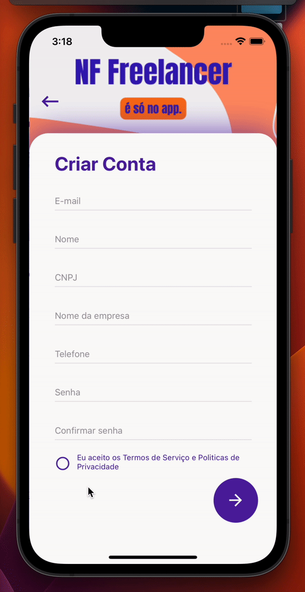

# NF Control Test

<br />
<div class="row">

  <div style="width: 50%; float:left; margin-right:20%">
Este é um Teste de Mobile Controle de NF Freelancer, aplicado pela Vibbra, e o projeto foi criado com Expo do React Native

### 💻 As tecnologias utilizadas foram:

    - React Native Expo;
    - Typescript;
    - Styled-Components;
    - Context Api
    - React Native Svg Charts;

  </div>
  <div class="column" style="margin-left: 30px">
  

  </div>
</div>

<br />

### ⚒️ Instalação

Para instalar abra o terminal do seu computador, navegue até a pasta raiz do projeto e digite:

```

npx install

ou

yarn

```

👨🏾‍💻 Após a instalação das dependências, basta executar o seguinte comando:

Instalar o node_modules:

```

> npm install

ou

> yarn

```

📱 Após a instalação das dependências, escolha a plataforma e rode o seguinte comando:

```

> npm android (yarn android)

ou

> npm ios (yarn ios)

```
